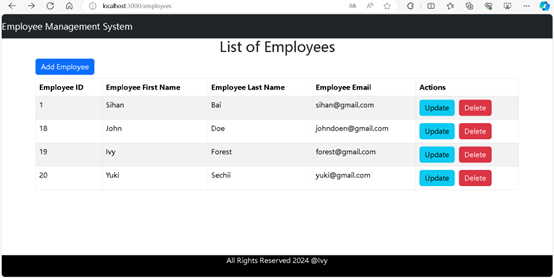
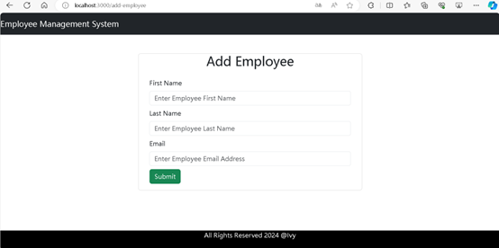
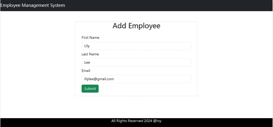
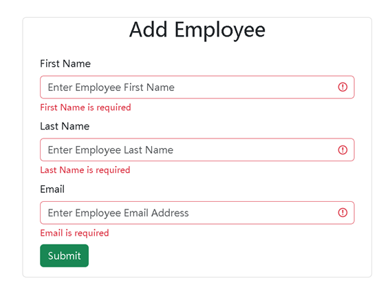
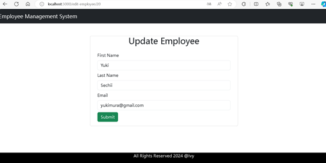
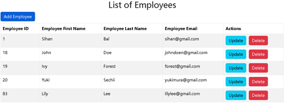
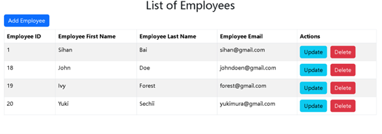

# Employee-Management

## Features

- Add Employee
- Update Employee
- List Employees
- Delete Employee

## Setup

### Backend

1. Create Spring initializr.
2. Navigate to the `backend` folder and open it in terminal.
3. Run EmployeeController.java.
4. Ensure MySQL is running and accessible. Update the `application.properties` file with MySQL credentials.

### Frontend

1. Navigate to the `frontend` folder and open it in terminal.
2. Using Vite, run the following commands to start the React application:
    ```bash
    npm run dev
    ```

## Technologies Used

- Spring Boot
- MySQL
- React
- Axios

## Languages Used

- Java
- JavaScript
- CSS

### Screenshots

#### Main Page
List of employees:



#### Add Employee



After inputing the employee information:



If the employee information is empty, it shows:



#### Update Employee
Edit email address, from yuki@gmail.com to yukimura@gmail.com:




After editing the employee information, the list of employees:



#### Delete Employee

